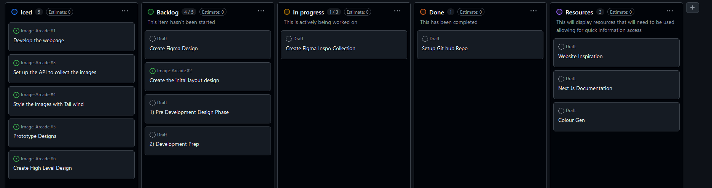

## Image Arcade
The purpose of this services is to allow the user to run the service and see a collection of different images once the window loads.

The user is able to actively refresh the page and get a new style of images.

The services used: 
- [Next.js](https://nextjs.org/) an open source framework used to build web applications 
- [Picsum](https://picsum.photos/) A placeholder free image site (The Lorem Ipsum for photos)

## Getting Started
To run the service you need a tool that can manage packages such as [Node.js](https://nodejs.org/en/download)

Once that is downloaded and installed check your version:
```bash
node -v
```

Version used for the site 
```bash
v20.11.0
```

First, go to the correct directory (you will need to be in the same location as the package.json):
```bash
cd image-gallery
```

Second, install the packages:
```bash
npm install
# or other
```

Finally, run the development server:

```bash
npm run dev
# or
yarn dev
# or
pnpm dev
# or
bun dev
```

Open [http://localhost:3000](http://localhost:3000) with your browser to see the result.

Image Collection

