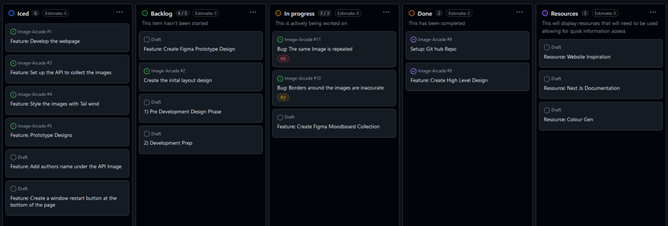
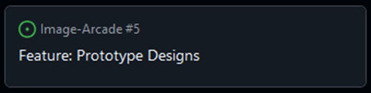
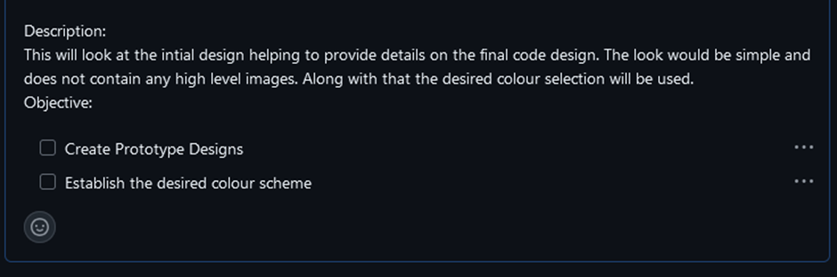
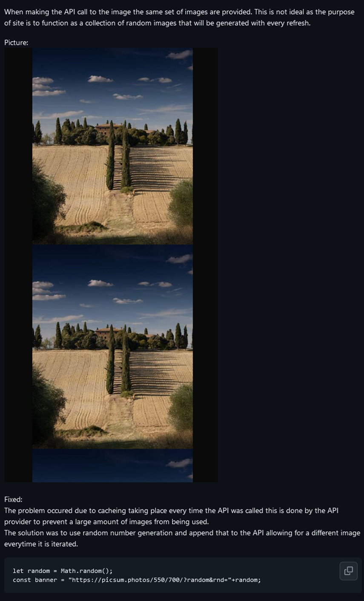
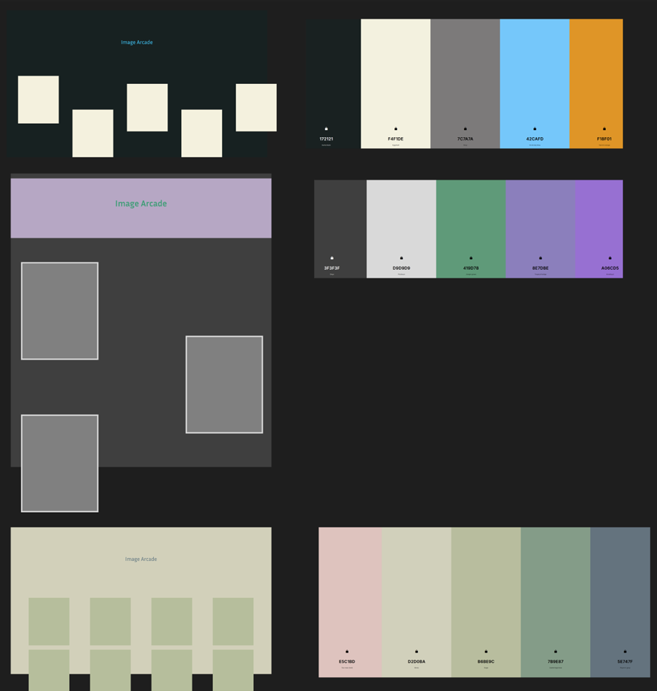
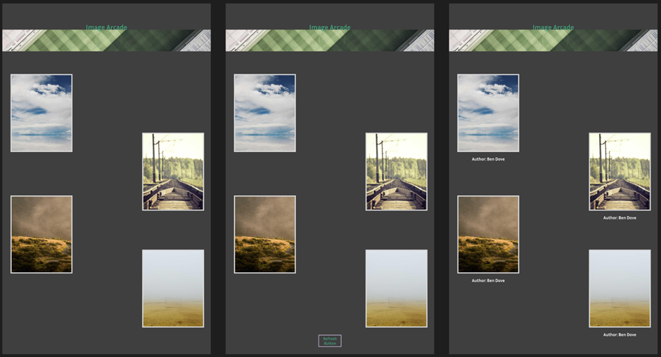
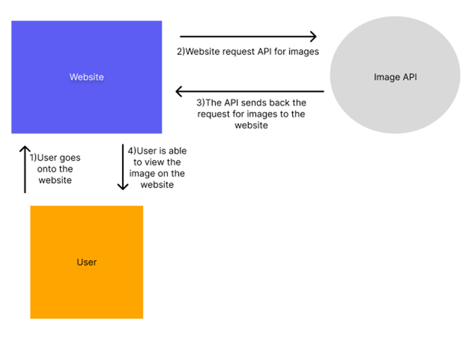
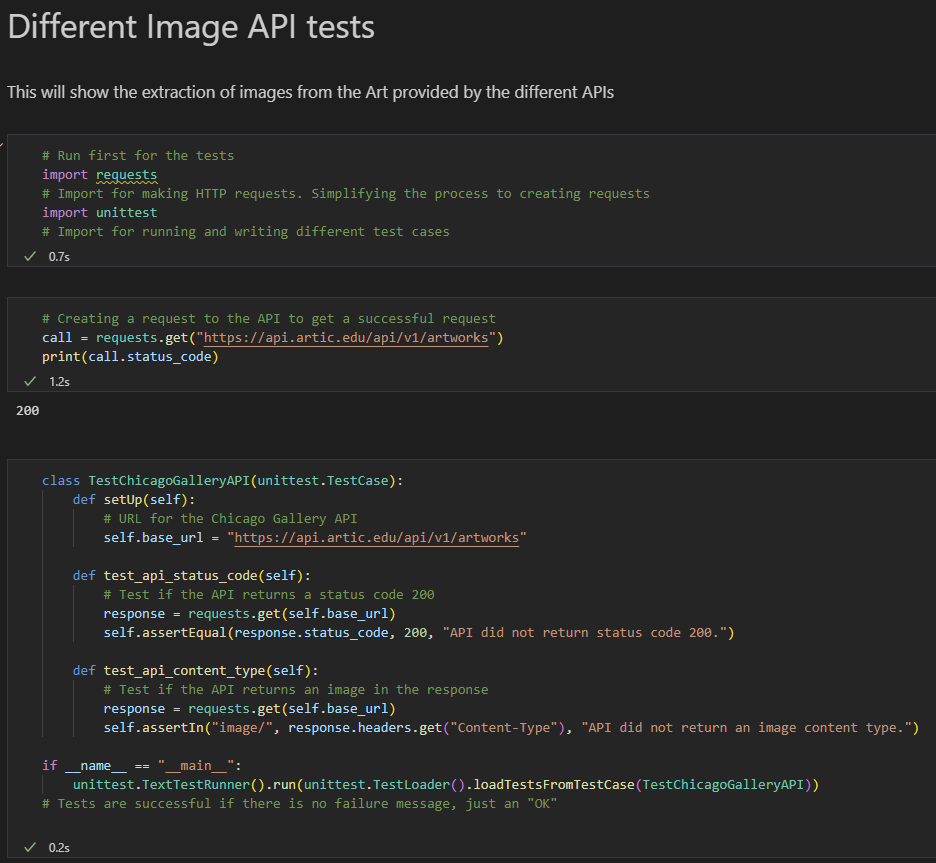
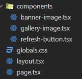
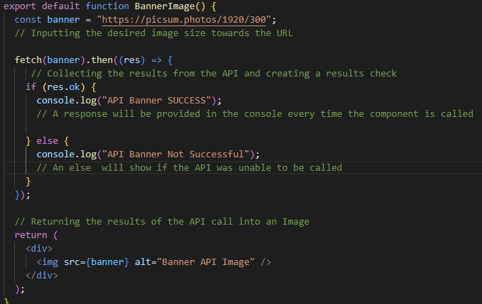

# Table of Contents
1. [Introduction](#introduction)
2. [Image Arcade](#image-arcade)
3. [Project Plan](#project-plan)
4. [Design plan](#design-plan)
5. [Code development](#code-development)
6. [Conclusion](#conclusion)
7. [References](#references)

## Introduction

Website development and APIs are an important aspect within the world of technology and is a central aspect within the internet. 
The development of the Image Arcade project will be used as a form of self-learning to understand the implementation of APIs and how they are used to present information using an effective website. 
The report will express information towards the process that took place when trying to build the initial coded service and the effort that was taken to develop the overall design and the various methods that were used to build the final product. 
This will also show the instructions of trying to run the services and the process that took place when creating the final build.

## Image Arcade
The purpose of this services is to allow the user to run the service and see a collection of different images once the window loads.

The user is able to actively refresh the page and get a new style of images.

The services used:
- [Git Repo Link](https://github.com/Imtiyaz-Rahman/Image-Arcade) a platform to store and share code and hold the location of the Image Arcade
- [Next.js](https://nextjs.org/) an open source framework used to build web applications 
- [Picsum](https://picsum.photos/) A placeholder free image site (The Lorem Ipsum for photos)

### Getting Started
To run the service you need a tool that can manage packages such as [Node.js](https://nodejs.org/en/download)

Once that is downloaded and installed check your version:
```bash
node -v
```

Version used for the site 
```bash
v20.11.0
```

First, go to the correct directory (you will need to be in the same location as the package.json):
```bash
cd Image-Arcade
```

Second, install the packages:
```bash
npm install
# or other
```

Finally, run the development server:

```bash
npm run dev
# or
yarn dev
# or
pnpm dev
# or
bun dev
```

Open [http://localhost:3000](http://localhost:3000) with your browser to see the result.

### Git Pages
The site is also accessible with the use of Github pages [Image Arcade](https://imtiyaz-rahman.github.io/Image-Arcade/)

### Git Project Board
This will show the overview of the [Git Project Board](https://github.com/users/Imtiyaz-Rahman/projects/2)


## Project Plan 

Systems such as Kanban have played a key role in supporting the process of production development from large scale to personal projects. 
Kanban is a system that helps to ensure that production in one area is only allowed if the next stream of production has a demand for new work, allowing processes to be controlled by the entire team (Ríos-Mercado and Ríos-Solís, 2012).
The project used Kanban to control the overall flow of work. This was done along with the process of Agile where features were tested and ideas were pushed to see different outcomes of the final service.

The use of the Github project board, as shown in figure 1 and figure 2, was an effective tool to understand the tasks that needed to be completed and provided an area to group the different tasks within their respective categories. 

Figure 1 (Not Completed Board)




Figure 2 (Completed Board)


### Category system

When developing the Kanban board, it functioned as a starting point to establish ideas that were intended for production, more specifically “Iced” which is a category used to input features that are intended to be implemented within the build and will be pushed through the various stages once in production. This idea of creating ideas within the “Iced” section has been a method within the IBM client engineering team, this is an important aspect as the team are able to work with the client and understand what features would be necessary and viable allowing for effective collaboration to occur and ensuring the bad features to be removed or adapted to better suit the final product. The practice that took place when using the “Iced” within the Image Arcade is the practice of identifying the different features and understanding whether certain features should be added or not. An example of this is the use of attaching the author's name to the image, which was left in the Ice Box due to the limitations of the API and changing the structure of how the API is called, which would be a lot to handle. This was left in the Ice Box with a comment as to why it was not implemented.

Once ideas are confirmed in the Kanban board, they are taken from the Icebox and moved to the "Backlog". This is a section used to hold up to five ticket ideas that will be implemented in the build, but are currently on hold until there is space in the "In progress" category. The "In Progress" category is used to hold three tickets and allows the team or individual to understand the tasks that need to be completed and what is being worked on to ensure that the task meets the desired standard, once fully completed this can be moved to "Done", which is a category that provides a section of all tickets that have been fully completed and there is no limit to this section. Finally there is a sub-category called Resources, this is used as an information section where key resources such as guides and tools can be linked to help people complete the desired tasks.


### Ticketing method

The ticketing system is an important aspect of many projects. Effective tickets can help to ensure that a desired feature or other can be explained and created within the project. The Image Arcade Board applies the use of having simple information allowing the user to get details by looking at the description. From the figure 3 provided below the ticketing standard that took place was to provide a simple and easy to read ticket that allowed a user to easily skim and understand the information. For example, the "Feature:" tag that would be added to the title of a ticket to indicate that it is a feature, this convention would also apply to bug tickets that have been created. Finally, there is a green dot above the ticket, this is used when expressing that something is being converted to an issue, however in this case it is used to show current features that are being implemented within the Image Arcade website.

Figure 3



Looking specifically at the description section of the Image Arcade Board, instructions are provided to help understand the process of resolving the ticket, such as providing a "Description:" this provides the general overview of the ticket and what needs to be done. Then providing an "Objective:" which helps to express what needs to be completed in a simple format that can be reviewed, as shown in Figure 4.

Figure 4



This process also applies to bugs, as a description is provided along with a potential image to show the problem in a visual format. If a fix exists, then further down the ticket description it would have a "fixed" tag, a summary of the problem would be explained along with how it was resolved, as shown in Figure 5.

Figure 5




## Design plan

Designs are an important aspect of many projects, helping to create the desired look and feel of a service and acting as a guide to developers on how a service should look to users.

### Mood board

When developing the look of the Image Arcade, a lot of effort was put into creating the initial idea, such as the use of the mood board as shown in Figure 6. This mood board was a collection of different images from other websites that were presented on the [awwwards](https://www.awwwards.com/) website that showcase unique and interesting sites, creating inspiration for the Image Arcade. The images help to understand the overall design, as the intention would be to use an API to display interesting images to the user.

Figure 6


### Design Prototypes

Prototypes are a necessary aspect to understand the approach that would be taken, due to the short deadline of the project the best approach was to test ideas within the design software rather than the code base of the Image Arcade to avoid wasting time. The design platform Figma was used because of its easy-to-understand design tools allowing designs to be created and refined.

The approach to the design was to base the concepts on the mood board whilst making adjustments, as shown in Figure 7. This was helpful as it gave an idea of the desired look when creating the site, along with certain features that could be taken from the mood board and implemented within the designs.

Another aspect that was taken into consideration for the design of the site was the use of a colour palette generator. A site called [coolors](https://coolors.co/) helped to generate colour palettes that worked well together, preventing heavy amounts of testing to find the desired colour scheme. From the prototype image provided, each of the different designs have a colour palette next to them and each of the different colours were tested. This helped to select the best website layout with the desired colour scheme for the design.

Figure 7




### High Level Designs 

Expanding on the design prototype, the use of high level designs help to give an accurate view of what would be desired within the look and feel of the website. In comparison to the prototype models they do not contain in depth details but can be used to further enhance concepts, such as Figure 8. Taking the initial design prototype and adding the images that would be presented into the actual design helped to create a template, when building the website.

Another aspect that was used with the high level design was to test new features on the prototype, this helped to show how new features would look. This process of experimentation helped to act as a template to be used when implementing the design into code.

Figure 8




## Code development

Coding is a fundamental aspect within projects and allows the creation of different services. The coding process that was used to build the service was the Nextjs framework. The intention was to improve skills with the use of React and develop a further understanding of APIs. 


### Architecture

The initial code was based on the architecture to understand the general flow of how assets would connect, specifically the APIs connection as provided from Figure 9. It shows a general view of how the connection would occur where the user would send a request to view the website, a request is sent to the API to receive and then present the data on the website. When building the service, the general layout is shown and more complex features would be placed as components, this helped to provide clear and easier to read code. Due to the lack of components, there was no need for a large folder convention when trying to sort the components.

Figure 9




### API testing

Testing is important and can help to ensure that a service works. Within the image arcade, testing was done to find the desired image API, which was necessary as it showed how the different APIs would work and prevented wasted effort being put in due to an API's limitations within the final service. In Figure 10 and [image-API-tests](tests/image-API-tests.ipynb), the use of Jupyter notebooks was applied allowing for a controlled environment, making it easier to test. Along with this, test cases could be easily implemented to see the function and output of the different APIs, ensuring that the desired API could be selected.

Figure 10




### Code Framework

The built application makes use of Nextjs, a full stack framework that allows the creation of React applications. The reason for using Nextjs is its ability to build server side applications along with being built for production use. This ensures that less work needs to be done within the initial setup preventing time from being wasted along with that Nextjs is packaged with Typescript, a super set of JavaScript allowing it to function within the browser and ensure that type errors are reduced, helping to prevent future bugs compared to JavaScript which can allow "any" type to be inputted. Nextjs is one of the frameworks used within IBM, specifically the Client Engineering team, to build applications for clients to use, so it is important to learn how it works to further develop skills.


### File and Naming convention

When trying to create the naming convention of the file system, using the Google naming scheme where it was suggested to have file names that were all lower case and some may have underscores or dashes(Google,n.d). The scheme was helpful as it allowed a standardised naming convention making it easier to manage files. This practice would also apply to different variables within the code to keep it consistent, this only excluded functions as they were applied with Pascal case. The reason for Pascal case was to make it easier to differentiate between the variables and functions within the code. A reason for not using alternative conventions was because functions would fail if camel case or an alternative method of snake case was applied when exporting the function. Overall, the convention used made the code easier to read and understand.

Figure 11




### Commenting

Comments can be extremely helpful for code, within Image Arcade there were no general standards. Comments were treated as blocks that would be embedded to break up large chunks of code into sections, along with explaining what a section of code would do. When explaining logic such as a variable call or function, comments are presented at the bottom to allow the user to understand the code first and then read the details provided. However, this convention is not applied to frontend code as a general description is provided to a user, instead it prevents them from having to understand aspects such as tail wind styling that has been applied.

Figure 12




## Conclusion

Overall, Image Arcade works as an effective service for the time being. However, there are adjustments that can be made to improve its function, such as restricting the use of static images to a certain size, which is problematic as the site is designed for a 1080p resolution, but if a user has a different resolution, then the site will look odd. A future improvement would be to make the site more accessible and user friendly as it does not provide information to the user about what it does or provide colour blind friendly colours. Another aspect that could be improved is to make the service mobile friendly, this will help to improve the user experience when trying to use the service.


## References

Fireship. (2021) *Next.js in 100 Seconds // Plus Full Beginner's Tutorial* [online]. YouTube. Available at: https://www.youtube.com/watch?v=Sklc_fQBmcs (Accessed: 2 January 2025)

TypeScript with Benny Code. (2023) *What is TypeScript?* [online]. YouTube. Available at: https://www.youtube.com/watch?v=zpphULkLr3Y (Accessed: 3 January 2025)

Google (n.d.) *Google JavaScript Style Guide* [online]. Available at: https://google.github.io/styleguide/jsguide.html#file-name (Accessed: 8 January 2025)

Ríos-Mercado, R. and Ríos-Solís, Y. (2012) ‘Just-in-time systems’, *Springer*, 60(), pp.192 [online]. Available at: https://onesearch.library.northeastern.edu/discovery/fulldisplay?docid=alma9934783320001401&context=L&vid=01NEU_INST:NU_US&lang=en&search_scope=CDI_and_EResources&adaptor=Local%20Search%20Engine&tab=Everything&query=any,contains,Kanban&searchInFulltext=false 


